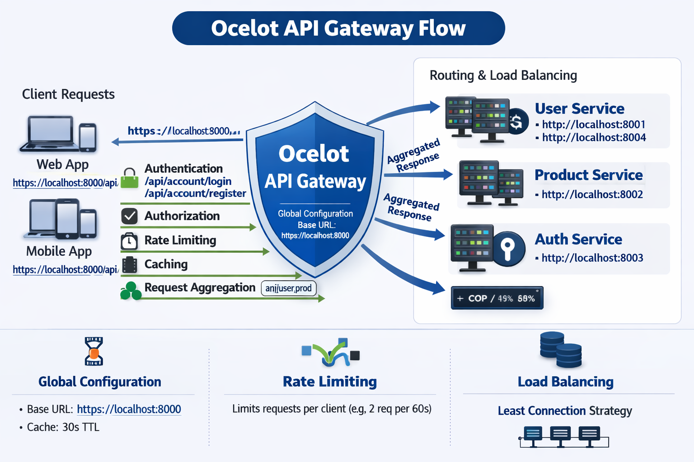
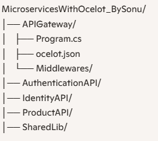

# Microservices with Ocelot API Gateway
# 📘 Key Notes: Microservices with Ocelot API Gateway

## 🏗️ API Gateway Architecture
- **[API Gateway](ca://s?q=Explain_API_Gateway_Architecture)** acts as a single entry point for all client requests.  
- Routes traffic to downstream microservices (`UserService`, `ProductService`, `AccountService`).  
- Provides centralized **security, routing, caching, and aggregation**.  
- Simplifies client communication by hiding internal microservice details.

---

## 🔐 Authentication
- **[Authentication](ca://s?q=API_Gateway_Authentication)** ensures that only valid users can access services.  
- Implemented via **custom middleware** (`TokenCheckerMiddleware`).  
- Login/Register routes (`/api/account/login`, `/api/account/register`) connect to **IdentityAPI** for token issuance.  
- Typically uses **JWT tokens** for secure communication.

---

## 🛡️ Authorization
- **[Authorization](ca://s?q=API_Gateway_Authorization)** checks user roles/claims after authentication.  
- Example: Only Admin role can access certain Product APIs.  
- Enforced via `app.UseAuthorization()` in **Program.cs**.  
- Ensures fine-grained access control across microservices.

---

## ⚖️ Rate Limiting
- **[Rate Limiting](ca://s?q=Rate_Limiting_in_Ocelot)** prevents abuse and ensures fair usage.  
- Configured in `Ocelot.json` using `RateLimitOptions`.  
- Example: `UserService` allows **2 requests per 60 seconds per client**.  
- Helps protect services from overload and denial-of-service attacks.

---

## 🔗 Request Aggregation
- **[Request Aggregation](ca://s?q=Request_Aggregation_in_Ocelot)** combines multiple downstream responses into one.  
- Example: `/api/aggregate/user_prod` merges **UserService** and **ProductService** data.  
- Useful for dashboards or composite views.  
- Configured via `Aggregates` with `RouteKeys`.

---

## 🗄️ Caching
- **[Caching](ca://s?q=Caching_in_Ocelot)** improves performance by reducing repeated downstream calls.  
- Global cache enabled: `TtlSeconds=30`.  
- Custom header `OC-Caching-Control` can override caching behavior.  
- Reduces latency and improves scalability.

---

## 🚦 Routing
- **[Routing](ca://s?q=Routing_in_Ocelot)** defines how requests are mapped.  
- **UpstreamPathTemplate** → Client-facing route (`/api/user`, `/api/product`).  
- **DownstreamPathTemplate** → Actual microservice endpoint (`localhost:8001`, `localhost:8002`).  
- Supports multiple downstream hosts with **Load Balancing** (`LeastConnection` strategy).  
- Ensures efficient request distribution across services.

# 🎯 Interview Q&A: Microservices with Ocelot API Gateway

## 🏗️ API Gateway Architecture
- **Q: Why do we need an API Gateway in microservices?**  
  **A:** It acts as a single entry point, simplifies client communication, centralizes cross‑cutting concerns (auth, logging, caching), and hides internal service details.  

- **Q: How does Ocelot differ from YARP or other gateways?**  
  **A:** Ocelot is lightweight, designed for .NET microservices, with built‑in routing, rate limiting, caching, and aggregation. YARP is more flexible but requires more configuration.  

---

## 🔐 Authentication
- **Q: How do you validate JWT tokens at the gateway level?**  
  **A:** By using middleware (`TokenCheckerMiddleware`) that checks token validity, expiry, and claims before forwarding requests.  

- **Q: What’s the difference between authentication and authorization?**  
  **A:** Authentication verifies identity (who you are), while authorization checks permissions (what you can do).  

---

## 🛡️ Authorization
- **Q: How is role‑based authorization implemented in Ocelot?**  
  **A:** Using `app.UseAuthorization()` with policies or claims, ensuring only users with specific roles can access certain routes.  

- **Q: Can authorization be applied per route in Ocelot.json?**  
  **A:** Yes, by defining route‑level authentication schemes and authorization policies.  

---

## ⚖️ Rate Limiting
- **Q: How do you configure rate limiting in Ocelot?**  
  **A:** In `Ocelot.json` under `RateLimitOptions` (Period, Limit, ClientIdHeader).  

- **Q: What happens if a client exceeds the rate limit?**  
  **A:** The gateway returns HTTP 429 (Too Many Requests).  

- **Q: How do you whitelist certain clients?**  
  **A:** By adding client IDs to the `ClientWhitelist` property.  

---

## 🔗 Request Aggregation
- **Q: How does Ocelot handle multiple downstream responses?**  
  **A:** It merges responses from configured `RouteKeys` into a single JSON output.  

- **Q: What’s a real‑world use case for request aggregation?**  
  **A:** A dashboard that needs both user profile and product data in one API call.  

---

## 🗄️ Caching
- **Q: How does caching improve performance in API Gateway?**  
  **A:** It reduces repeated downstream calls, lowers latency, and improves scalability.  

- **Q: What’s the impact of TTL settings?**  
  **A:** TTL defines how long responses are cached; too high may serve stale data, too low reduces caching benefits.  

---

## 🚦 Routing
- **Q: Explain the difference between Upstream and Downstream path templates.**  
  **A:** Upstream is the client‑facing route (`/api/user`), Downstream is the actual microservice endpoint (`localhost:8001`).  

- **Q: How does Ocelot handle load balancing?**  
  **A:** It distributes requests across multiple downstream hosts using strategies like `LeastConnection` or `RoundRobin`.  

# 🎯 Scenario-based Q&A: Microservices with Ocelot API Gateway

## 🏗️ API Gateway Architecture
- **Q: Suppose your client app needs to call 5 different microservices. How would you simplify this?**  
  **A:** I would introduce an **API Gateway (Ocelot)** as a single entry point. Instead of the client calling each service separately, the gateway routes requests internally, applies security, and aggregates responses if needed. This reduces client complexity and improves maintainability.  

---

## 🔐 Authentication
- **Q: Imagine a user tries to access `/api/product` without logging in. What happens?**  
  **A:** The **TokenCheckerMiddleware** intercepts the request, checks for a valid JWT token. If missing or invalid, the gateway rejects the request with `401 Unauthorized`. Only authenticated users can proceed.  

- **Q: What if the token is expired?**  
  **A:** The middleware detects expiry and denies access. The client must re‑authenticate via `/api/account/login` to get a fresh token.  

---

## 🛡️ Authorization
- **Q: A logged‑in user with role `User` tries to delete a product. How do you handle this?**  
  **A:** The gateway enforces **role‑based authorization**. Since only `Admin` role is allowed for delete operations, the request is blocked with `403 Forbidden`.  

---

## ⚖️ Rate Limiting
- **Q: A client sends 10 requests to `/api/user` within 60 seconds. What happens?**  
  **A:** Ocelot’s `RateLimitOptions` allow only **2 requests per 60s**. After the limit is exceeded, the gateway returns `429 Too Many Requests`. This protects downstream services from overload.  

- **Q: How would you allow a VIP client to bypass rate limiting?**  
  **A:** Add their `ClientId` to the `ClientWhitelist` in `Ocelot.json`.  

---

## 🔗 Request Aggregation
- **Q: A dashboard needs both user info and product list in one API call. How do you design this?**  
  **A:** Configure an **aggregate route** `/api/aggregate/user_prod` in Ocelot. It fetches data from `UserService` and `ProductService`, merges responses, and returns a single JSON payload to the client.  

---

## 🗄️ Caching
- **Q: A product list is requested repeatedly within 30 seconds. How does Ocelot optimize this?**  
  **A:** With caching enabled (`TtlSeconds=30`), the gateway serves the cached response instead of hitting the downstream service again. This reduces latency and improves performance.  

- **Q: What if the product data changes during caching?**  
  **A:** Clients may see slightly stale data until TTL expires. For critical data, caching can be disabled per route.  

---

## 🚦 Routing
- **Q: A client calls `/api/user`. How does Ocelot decide which downstream service to hit?**  
  **A:** Ocelot maps the **UpstreamPathTemplate** (`/api/user`) to multiple downstream hosts (`localhost:8001, 8004, 800

# 🔄 Cross Question & Answer: Microservices with Ocelot API Gateway

## 🏗️ API Gateway Architecture
- **Q: Why do we need an API Gateway in microservices?**  
  **A:** It simplifies client communication, centralizes security, and hides internal service details.  

  **Cross‑Q: What if the API Gateway itself fails?**  
  **A:** It becomes a single point of failure. To mitigate, we deploy multiple gateway instances behind a load balancer for high availability.  

---

## 🔐 Authentication
- **Q: How do you validate JWT tokens at the gateway level?**  
  **A:** Middleware checks token validity, expiry, and claims before forwarding requests.  

  **Cross‑Q: What if the token is tampered with?**  
  **A:** Since JWTs are signed, tampering invalidates the signature. The gateway rejects the request with `401 Unauthorized`.  

---

## 🛡️ Authorization
- **Q: How is role‑based authorization implemented in Ocelot?**  
  **A:** Using `app.UseAuthorization()` with policies or claims.  

  **Cross‑Q: What if a user has multiple roles?**  
  **A:** Claims can hold multiple roles. Policies can check for any or all roles depending on business rules.  

---

## ⚖️ Rate Limiting
- **Q: How do you configure rate limiting in Ocelot?**  
  **A:** In `Ocelot.json` under `RateLimitOptions` (Period, Limit, ClientIdHeader).  

  **Cross‑Q: What if multiple clients share the same ClientId?**  
  **A:** They’ll share the same quota. To avoid this, assign unique ClientIds per client application.  

---

## 🔗 Request Aggregation
- **Q: How does Ocelot handle multiple downstream responses?**  
  **A:** It merges responses from configured `RouteKeys` into one JSON output.  

  **Cross‑Q: What if one downstream service fails during aggregation?**  
  **A:** Ocelot can return partial results or an error depending on configuration. Best practice is to handle fallback logic in the gateway or client.  

---

## 🗄️ Caching
- **Q: How does caching improve performance in API Gateway?**  
  **A:** It reduces repeated downstream calls and improves response time.  

  **Cross‑Q: What if cached data becomes stale?**  
  **A:** TTL ensures data refresh after expiry. For critical data, cache can be disabled or invalidated manually.  

---

## 🚦 Routing
- **Q: Explain Upstream vs Downstream path templates.**  
  **A:** Upstream is client‑facing (`/api/user`), Downstream is actual microservice endpoint (`localhost:8001`).  

  **Cross‑Q: What if downstream services use different versions of APIs?**  
  **A:** The gateway can route based on versioned upstream paths (e.g., `/api/v1/user`, `/api/v2/user`) to different downstream services.  

## 📖 Project Overview
This project demonstrates a **microservices architecture** using **Ocelot API Gateway** in .NET.  
It integrates multiple services — **UserService**, **ProductService**, and **Authentication/IdentityService** — behind a single gateway, providing centralized **routing, authentication, authorization, rate limiting, caching, and request aggregation**.

---

## 📂 Project Structure

## 🏗️ Architecture
- **[API Gateway](ca://s?q=Explain_API_Gateway_Architecture)**: Single entry point for all client requests.  
- **Microservices**: Independent services (`User`, `Product`, `Account`) running on different ports.  
- **Middleware**: Custom middlewares (`TokenCheckerMiddleware`, `InterceptionMiddleware`) for security and request handling.  
- **Load Balancing**: Configured via Ocelot (`LeastConnection` strategy).  

---

## 🔐 Authentication & Authorization
- **[Authentication](ca://s?q=API_Gateway_Authentication)** handled via `TokenCheckerMiddleware`.  
- **[Authorization](ca://s?q=API_Gateway_Authorization)** enforced using `app.UseAuthorization()` with role/claim checks.  
- Login/Register routes connect to **IdentityAPI** for issuing JWT tokens.

---

## ⚖️ Rate Limiting
- Configured in `Ocelot.json` with `RateLimitOptions`.  
- Example: `UserService` allows **2 requests per 60 seconds per client**.  
- Prevents abuse and ensures fair usage across clients.

---

## 🔗 Request Aggregation
- Aggregate route `/api/aggregate/user_prod` merges **UserService** and **ProductService** responses.  
- Useful for dashboards or composite views.  
- Configured via `Aggregates` with `RouteKeys`.

---

## 🗄️ Caching
- Global cache enabled: `TtlSeconds=30`.  
- Reduces repeated downstream calls.  
- Custom header `OC-Caching-Control` can override caching behavior.

---

## 🚦 Routing
- **UpstreamPathTemplate** → Client-facing route (`/api/user`, `/api/product`).  
- **DownstreamPathTemplate** → Actual microservice endpoint (`localhost:8001`, `localhost:8002`).  
- Supports multiple downstream hosts with load balancing.

---

